# Information Architecture: Settings Module

This document outlines the Information Architecture (IA) for the Settings module, based on the provided product structure.

## Overview

The Settings module is divided into three main sections:
1. **Global Settings**: Core configurations like currency and customer attributes.
2. **Integration Settings**: Connectivity configurations like API tokens.
3. **Basic Data**: Foundation data for the system, including stores and products.

## IA Diagram

```mermaid
graph TD
    Settings[Settings] --> Global[Global Settings]
    Settings --> Integration[Integration Settings]
    Settings --> Basic[Basic Data]

    %% Global Settings
    Global --> Currency[Currency]
    Currency --> DefCurrency[Default Currency]
    Currency --> ExRateList[Exchange Rate List]
    Currency --> AddCurrency[Add Currency]

    Global --> CustAttr[Customer Attributes]
    CustAttr --> AttrList[Attribute List]
    CustAttr --> AddAttr[Add Attribute]

    %% Integration Settings
    Integration --> APIToken[API Token]
    APIToken --> TokenList[Token List]
    APIToken --> AddToken[Add Token]
    APIToken --> DelToken[Delete Token]

    %% Basic Data
    Basic --> Store[Store]
    Store --> StoreSearch[Search & Filter]
    Store --> StoreList[Store List]
    Store --> StoreAdd[Add Store]
    Store --> StoreImport[Import]

    Basic --> ProductModule[Product]
    ProductModule --> ProductTab[Product Sub-tab]
    ProductModule --> SeriesTab[Series Sub-tab]
    ProductModule --> BrandTab[Brand Sub-tab]

    ProductTab --> ProdSearch[Search & Filter]
    ProductTab --> ProdList[Product List]
    ProductTab --> ProdAdd[Add Product]

    SeriesTab --> SeriesSearch[Search]
    SeriesTab --> SeriesReorder[Drag to Reorder]
    SeriesTab --> SeriesLevelList[Series Level List]
    SeriesTab --> SeriesAddTop[Add Top-level]

    BrandTab --> BrandSearch[Search]
    BrandTab --> BrandReorder[Drag to Reorder]
    BrandTab --> BrandList[Brand List]
    BrandTab --> BrandAdd[Add Brand]
```

---

## 1. Global Settings (全局设置)

### 1.1 Currency (货币)
Manages the system's currency settings and exchange rates.

*   **Default Currency (默认货币)**: Permanent system setting for the base currency.
*   **Exchange Rate List (汇率列表)**:
    *   **Fields**: Currency, Rate (relative to default), Created At, Last Updated At.
    *   **Actions**: Edit, Delete.
*   **Add Currency (新增)**:
    *   **Input Fields**: Currency selection, Exchange Rate.

### 1.2 Customer Attributes (客户属性)
Defines custom data fields for customer profiles.

*   **Attribute List (属性列表)**:
    *   **Fields**: Attribute Code, Display Name, Type (Standard/Custom), Format, Required (Y/N), Unique (Y/N), Status (Active/Inactive).
    *   **Actions**: Enable/Disable, View, Edit, Delete.
*   **Add Attribute (新增)**:
    *   **Input Fields**: Attribute Code, Display Name, Format Selection (Text, Date, Datetime, Number, Single Select, Multiple Select, Boolean), Required toggle, Unique toggle.

---

## 2. Integration Settings (集成设置)

### 2.1 API Token
Manages access tokens for API integrations.

*   **Token List (token 列表)**:
    *   **Fields**: Name, Token (Masked), Created At, Status.
*   **Add Token (新增)**:
    *   **Input Fields**: Name.
*   **Delete Token (删除)**: Remove existing token access.

---

## 3. Basic Data (基础数据)

### 3.1 Store (店铺)
Management of physical or digital store locations.

*   **Filter & Search**: Search by Name or Code; filter by Type and Status.
*   **Store List (店铺列表)**:
    *   **Fields**: Store Code, Store Name, Type, Address, Contact, Business Hours, Status.
    *   **Actions**: Enable/Disable, View, Edit, Delete.
*   **Add/Edit Store (新增/编辑)**:
    *   **Input Fields**: Store Code, Store Name, Type, Address, Latitude/Longitude, Contact Info, Business Hours, etc.
*   **Import (导入)**: Batch upload store data via file.

### 3.2 Product (产品)
Central hub for product, series, and brand management, organized by sub-tabs.

#### 3.2.1 Product Sub-tab (产品)
*   **Filter & Search**: Search by SKU Code or Product Name; filter by Status.
*   **Product List (产品列表)**:
    *   **Fields**: Image, SKU Code, Product Name, Price, Series, Brand, Status.
    *   **Actions**: Enable/Disable, View, Edit, Delete.
*   **Add Product (新增)**:
    *   **Input Fields**: SKU Code, Product Name, Product Image, Price, Series selection, Brand selection, Description.

#### 3.2.2 Series Sub-tab (系列)
*   **Search**: By Series Code or Name.
*   **Structure**: Hierarchical list with drag-to-reorder capability.
*   **Series Level List (系列层级列表)**:
    *   **Fields**: Series Code, Series Name.
    *   **Actions**: Add Sub-level, Edit, Delete.
*   **Add Top-level (新增上层级)**: Create a new root series.

#### 3.2.3 Brand Sub-tab (品牌)
*   **Search**: By Brand Code or Name.
*   **Brand List (品牌列表)**:
    *   **Fields**: Brand Code, Brand Name.
    *   **Actions**: Drag to Reorder, Edit, Delete.
*   **Add Brand (新增)**:
    *   **Input Fields**: Brand Code, Brand Name.
