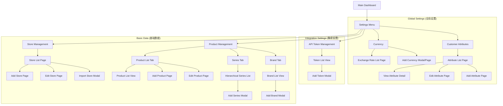

# Sitemap: Settings Module

This sitemap outlines the page hierarchy and accessibility of the Settings module within the XCRM platform.

## Site Structure

## Navigation Paths

| Level 1 | Level 2 | Level 3 / Actions |
| :--- | :--- | :--- |
| **Global Settings** | Currency | Default Currency, Rate List, New Rate |
| | Customer Attributes | Field List, New Field, Edit Field |
| **Integration** | API Token | Token List, Generate New Token |
| **Basic Data** | Store | Store List, Add Store, Import, Edit |
| | Product | Product Tab, Series Tab, Brand Tab |
