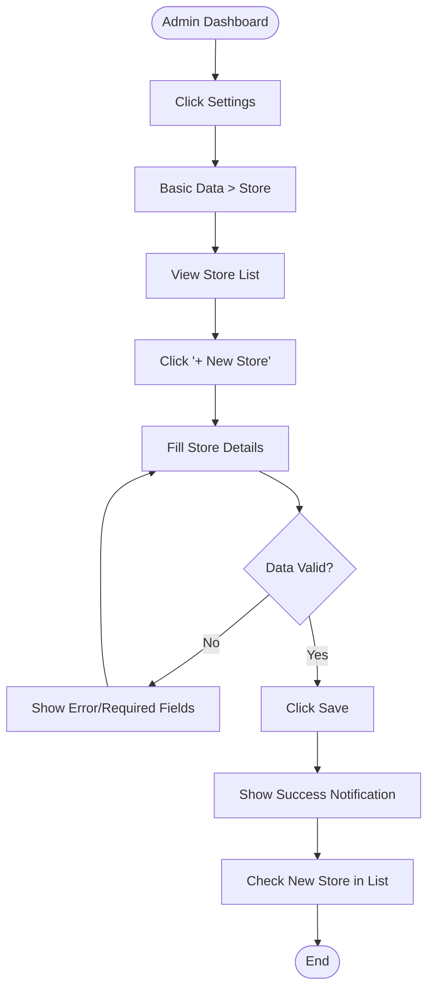
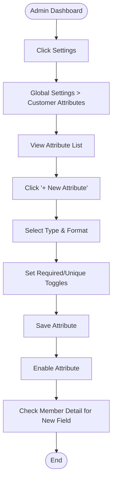
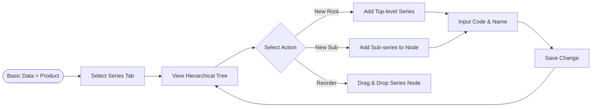
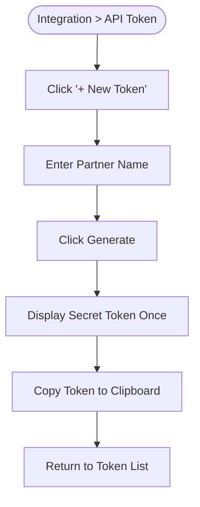

# User Flow: Settings Module

This document details the user journeys for key administrative tasks within the Settings module.

## 1. Store Setup Flow
Goal: Add a new physical store and verify its status.

## 2. Customer Attribute Integration
Goal: Create a custom field for member profiles to collect specific data.

## 3. Product Series Hierarchy Management
Goal: Organize products into a parent-child series structure.

## 4. API Token Generation
Goal: Create an access token for a third-party partner.

