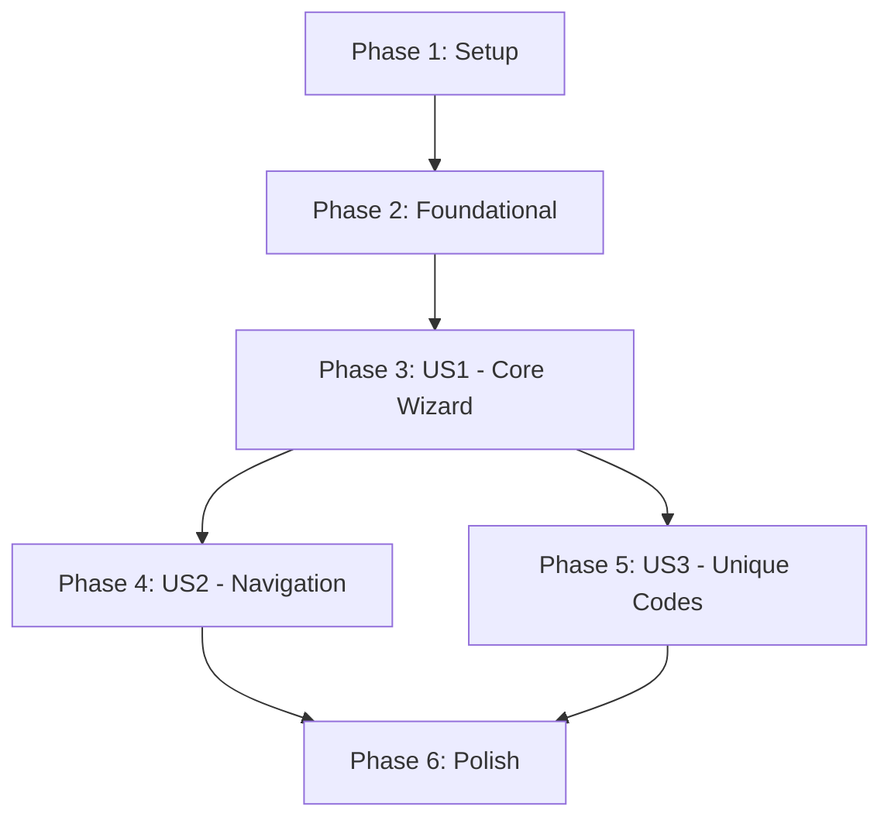

# Tasks: Coupon Refinement - Create Coupon Wizard

Feature: Coupon Refinement
Implementation Plan: [plan.md](file:///Users/elroyelroy/XCRM/specs/003-coupon-refinement/plan.md)
Specification: [spec.md](file:///Users/elroyelroy/XCRM/specs/003-coupon-refinement/spec.md)

## Phase 1: Setup

Goal: Initialize the project structure and verify the environment.

- [ ] T001 Create component directory structure at `src/components/coupon/` and `src/components/coupon/sections/`
- [ ] T002 Verify React 19 and Tailwind CSS configuration in `package.json` and `tailwind.config.js`
- [ ] T003 Ensure Lucide React is available for iconography in `package.json`

## Phase 2: Foundational

Goal: Define shared types and shared state management.

- [ ] T004 [P] Update `src/types.ts` with Coupon, CodeStrategy, and DistributionChannel types from `data-model.md`
- [ ] T005 [P] Implement `CouponWizardContext` for centralized state management in `src/context/CouponWizardContext.tsx`
- [ ] T006 [P] Implement `MockCouponService` for LocalStorage persistence in `src/services/MockCouponService.ts`
- [ ] T007 [P] Create base `AccordionSection` component wrapper with Tailwind transitions in `src/components/coupon/AccordionSection.tsx`

## Phase 3: User Story 1 - Create a standard cash discount coupon (P1)

Goal: Implement the core 5-step wizard flow and live preview for standard coupons.

- [ ] T008 [US1] Implement `EssentialsSection` for name, value, and discount type in `src/components/coupon/sections/EssentialsSection.tsx`
- [ ] T009 [US1] Implement `LifecycleSection` for dynamic/fixed validity in `src/components/coupon/sections/LifecycleSection.tsx`
- [ ] T010 [US1] Implement `GuardrailsSection` for min spend and stacking in `src/components/coupon/sections/GuardrailsSection.tsx`
- [ ] T011 [US1] Implement `InventorySection` for quota and per-user limits in `src/components/coupon/sections/InventorySection.tsx`
- [ ] T012 [US1] Implement `DistributionSection` for channel selection in `src/components/coupon/sections/DistributionSection.tsx`
- [ ] T013 [US1] Create sticky `LivePreview` component in `src/components/coupon/LivePreview.tsx`
- [ ] T014 [US1] Refactor `src/pages/CreateCoupon.tsx` to orchestrate accordion sections and context
- [ ] T015 [US1] Implement "Publish" action and mock API call in `src/pages/CreateCoupon.tsx`

## Phase 4: User Story 2 - Edit previous sections during creation (P2)

Goal: Enable fluid navigation between accordion sections while preserving data.

- [ ] T016 [US2] Implement section summary mode for collapsed headers in `src/components/coupon/AccordionSection.tsx`
- [ ] T017 [US2] Implement header click navigation to expand/collapse sections in `src/pages/CreateCoupon.tsx`
- [ ] T018 [US2] Enhance `CouponWizardContext` to track section validity and "touched" status in `src/context/CouponWizardContext.tsx`

## Phase 5: User Story 3 - Generate Unique Codes with CSV Export (P3)

Goal: Support unique code generation and CSV download.

- [ ] T019 [US3] Add "Unique Codes" strategy selection logic to `src/components/coupon/sections/InventorySection.tsx`
- [ ] T020 [US3] Implement dynamic footer button text change ("Publish & Generate CSV") in `src/pages/CreateCoupon.tsx`
- [ ] T021 [US3] Implement CSV generation utility using Blob API in `src/utils/csv_utils.ts`
- [ ] T022 [US3] Integrate CSV trigger into the "Publish" flow for unique code strategy in `src/pages/CreateCoupon.tsx`

## Phase 6: Polish & Cross-cutting Concerns

Goal: Final UI refinements, validation, and documentation.

- [ ] T023 [P] Implement auto-expand logic for sections with validation errors on Publish in `src/pages/CreateCoupon.tsx`
- [ ] T024 [P] Apply `rounded-2xl` and `slate-900` styling to all coupon components per `quickstart.md`
- [ ] T025 [P] Add accessibility labels (ARIA) to accordion headers and form inputs
- [ ] T026 Update `Journal.md` with implementation lessons and refactoring notes

## Dependency Graph

## Parallel Execution Examples

- **Foundational**: T004, T005, T006, and T007 can be built concurrently.
- **Form Sections**: T008, T009, T010, T011, and T012 can be developed in parallel as separate components.
- **Polish**: T024 and T025 can be done independently after US1 is complete.

## Implementation Strategy

1. **MVP First**: Deliver US1 (Standard Coupon) as a functional end-to-end flow.
2. **Incremental UX**: Layer US2 (Navigation) and US3 (Unique Codes) onto the working foundation.
3. **State Integrity**: Use the context provider as the single source of truth for both the form sections and the live preview.
4. **Visual Consistency**: Adhere strictly to the `rounded-2xl` card radius and `slate-900` button style throughout the refactor.
