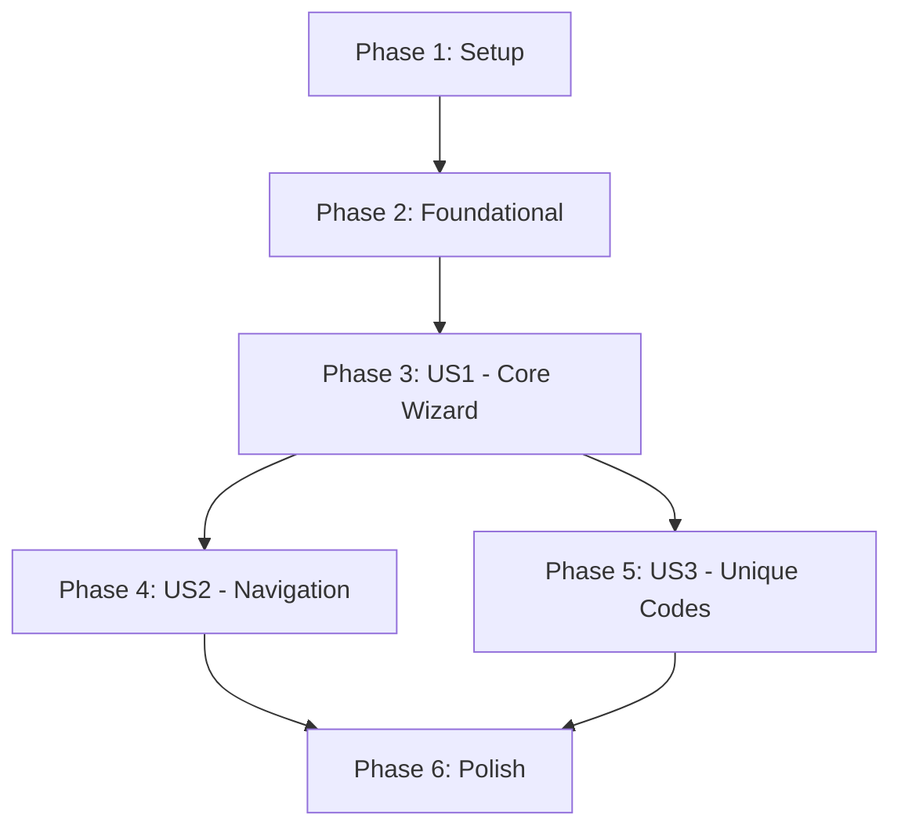

# Tasks: Coupon Refinement - Create Coupon Wizard

Feature: Coupon Refinement
Implementation Plan: [plan.md](file:///Users/elroyelroy/XCRM/specs/003-coupon-refinement/plan.md)
Specification: [spec.md](file:///Users/elroyelroy/XCRM/specs/003-coupon-refinement/spec.md)

## Phase 1: Setup ✅

Goal: Initialize the project structure and verify the environment.

- [x] T001 Create component directory structure at `src/components/coupon/` and `src/components/coupon/sections/`
- [x] T002 Verify React 19 and Tailwind CSS configuration in `package.json` and `index.html` (Tailwind via CDN)
- [x] T003 Ensure Lucide React is available for iconography in `package.json`

### Phase 1 Implementation Notes
- **T001**: Directories created at `src/components/coupon/` and `src/components/coupon/sections/`
- **T002**: Verified React 19.2.1 in `package.json`. Tailwind CSS is configured via CDN in `index.html` (line 7) with custom theme extending colors, borderRadius, and fonts.
- **T003**: Lucide React 0.559.0 confirmed in `package.json` dependencies and import map in `index.html`

## Phase 2: Foundational ✅

Goal: Define shared types and shared state management.

- [x] T004 [P] Update `src/types.ts` with Coupon, CodeStrategy, and DistributionChannel types from `data-model.md`
- [x] T005 [P] Implement `CouponWizardContext` for centralized state management in `src/context/CouponWizardContext.tsx`
- [x] T006 [P] Implement `MockCouponService` for LocalStorage persistence in `src/services/MockCouponService.ts`
- [x] T007 [P] Create base `AccordionSection` component wrapper with Tailwind transitions in `src/components/coupon/AccordionSection.tsx`

### Phase 2 Implementation Notes
- **T004**: Added types to `src/types.ts`:
  - `CodeStrategy`: 'random' | 'custom' | 'unique'
  - `DistributionChannel`: 'public_app' | 'points_mall' | 'manual_issue'
  - `ValidityType`: 'dynamic' | 'fixed'
  - `CouponExceptions`: blockedStores, blockedDates
  - `Coupon`: Full entity with all fields from data-model.md
  - `CouponWizardSection`: Section identifiers
  - `SectionValidation`: isValid, isTouched, errors
  - `CouponWizardState`: coupon, activeSection, sectionValidation, isDirty

- **T005**: Created `CouponWizardContext.tsx` with:
  - Reducer-based state management
  - Section validation functions for all 5 sections
  - Navigation helpers (goToNextSection, goToPreviousSection)
  - Summary generators for collapsed section headers
  - Section order constant exported for orchestration

- **T006**: Created `MockCouponService.ts` with:
  - LocalStorage CRUD operations for coupons
  - Draft management (saveDraft, loadDraft, clearDraft)
  - Unique code generation for US3
  - Async wrappers with simulated API delay

- **T007**: Created `AccordionSection.tsx` with:
  - Animated expand/collapse using Tailwind transitions
  - Visual states: active, complete, error
  - Step number indicator with CheckCircle2/AlertCircle icons
  - Summary text display when collapsed
  - ARIA attributes for accessibility
  - Keyboard navigation support (Enter/Space)

## Phase 3: User Story 1 - Create a standard cash discount coupon (P1) ✅

Goal: Implement the core 5-step wizard flow and live preview for standard coupons.

- [x] T008 [US1] Implement `EssentialsSection` for name, value, and discount type in `src/components/coupon/sections/EssentialsSection.tsx`
- [x] T009 [US1] Implement `LifecycleSection` for dynamic/fixed validity in `src/components/coupon/sections/LifecycleSection.tsx`
- [x] T010 [US1] Implement `GuardrailsSection` for min spend and stacking in `src/components/coupon/sections/GuardrailsSection.tsx`
- [x] T011 [US1] Implement `InventorySection` for quota and per-user limits in `src/components/coupon/sections/InventorySection.tsx`
- [x] T012 [US1] Implement `DistributionSection` for channel selection in `src/components/coupon/sections/DistributionSection.tsx`
- [x] T013 [US1] Create sticky `LivePreview` component in `src/components/coupon/LivePreview.tsx`
- [x] T014 [US1] Refactor `src/pages/CreateCoupon.tsx` to orchestrate accordion sections and context
- [x] T015 [US1] Implement "Publish" action and mock API call in `src/pages/CreateCoupon.tsx`

### Phase 3 Implementation Notes
- **T008 EssentialsSection**: Name input, discount type selector (cash/percentage/gift/shipping), value input with SentenceInput component
- **T009 LifecycleSection**: Rolling vs fixed validity selection, dynamic days input, fixed date pickers, extend-to-end-of-month option
- **T010 GuardrailsSection**: Minimum spend input, stackable vs exclusive toggle, cart limit per transaction
- **T011 InventorySection**: Code strategy selector (random/custom/unique), custom code input, total quota and per-user limit inputs
- **T012 DistributionSection**: Multi-select channel picker (public_app/points_mall/manual_issue) with checkbox-style UI
- **T013 LivePreview**: Mobile device simulation, voucher card with gradient colors, usage rules display, stacking badge, wallet preview
- **T014 CreateCoupon Refactor**:
  - Wrapped in `CouponWizardProvider` for state management
  - Uses `SECTION_CONFIG` array for declarative section rendering
  - Section navigation via `handleSectionClick` and `handleContinue`
  - Auto-save draft every 2 seconds when dirty
- **T015 Publish Action**:
  - Validates all sections before publishing
  - Auto-expands first invalid section on validation failure
  - Uses `MockCouponService.publishCouponAsync()` for persistence
  - Converts to legacy `CouponData` format for `CouponContext` compatibility
  - Triggers onboarding completion for `launch` mission

## Phase 4: User Story 2 - Edit previous sections during creation (P2) ✅

Goal: Enable fluid navigation between accordion sections while preserving data.

- [x] T016 [US2] Implement section summary mode for collapsed headers in `src/components/coupon/AccordionSection.tsx`
- [x] T017 [US2] Implement header click navigation to expand/collapse sections in `src/pages/CreateCoupon.tsx`
- [x] T018 [US2] Enhance `CouponWizardContext` to track section validity and "touched" status in `src/context/CouponWizardContext.tsx`

### Phase 4 Implementation Notes
- **T016 AccordionSection Enhancements**:
  - Added `isEditing` prop to show "Editing" badge when user returns to earlier section
  - Enhanced summary display with error icons (AlertCircle) and success icons (CheckCircle2)
  - Summary now shows first validation error when section has errors (e.g., "⚠ Name is required")
  - Added green border styling for completed sections
  - Auto-scroll into view when section becomes active
  - ChevronUp indicator when section is expanded

- **T017 Smart Navigation in CreateCoupon**:
  - `handleSectionClick`: Validates current section before switching to preserve data integrity
  - `handleContinue`: Uses `continueFromCurrentSection()` for smart navigation
  - Button changes to "Done Editing" with CornerUpRight icon when editing earlier section
  - Button styling changes to amber when in edit mode
  - `isEditing` state calculated per-section based on position vs furthestSection

- **T018 Enhanced CouponWizardContext**:
  - Added `furthestSection` to track the furthest section user has navigated to
  - Added `previousSection` to track navigation history
  - New `continueFromCurrentSection()` method implements smart continue:
    - If editing earlier section: returns to first uncompleted section or furthest reached
    - If normal progression: advances to next section
  - New `isEditingPreviousSection()` helper to detect edit mode
  - New `getNextUncompletedSection()` to find gaps in completion
  - New `getSectionErrors()` to retrieve validation errors for display
  - Updated state type in `types.ts` with `furthestSection` and `previousSection`

## Phase 5: User Story 3 - Generate Unique Codes with CSV Export (P3) ✅

Goal: Support unique code generation and CSV download.

- [x] T019 [US3] Add "Unique Codes" strategy selection logic to `src/components/coupon/sections/InventorySection.tsx`
- [x] T020 [US3] Implement dynamic footer button text change ("Publish & Generate CSV") in `src/pages/CreateCoupon.tsx`
- [x] T021 [US3] Implement CSV generation utility using Blob API in `src/utils/csv_utils.ts`
- [x] T022 [US3] Integrate CSV trigger into the "Publish" flow for unique code strategy in `src/pages/CreateCoupon.tsx`

### Phase 5 Implementation Notes
- **T019 InventorySection Unique Codes**:
  - Three-way code strategy selector (random/custom/unique) with icons
  - Unique codes panel shows informational banner about CSV download
  - Optional code prefix input with preview (e.g., "SPRING-XXXXXX")
  - Estimated CSV file size calculation based on quota
  - FileSpreadsheet icon for visual feedback

- **T020 Dynamic Button Text**:
  - `isUniqueCodeStrategy` boolean derived from `state.coupon.codeStrategy`
  - Button shows FileDown icon and "Publish & Generate CSV" when unique strategy selected
  - Otherwise shows Rocket icon and "Publish Coupon"

- **T021 CSV Utilities** (`src/utils/csv_utils.ts`):
  - `generateUniqueCodes()`: Creates unique codes with Set for deduplication
  - `createCSVContent()`: Builds CSV string with optional headers and columns
  - `generateCSVExport()`: Creates Blob and data URL for download
  - `downloadCSV()`: Triggers browser file download via hidden anchor
  - `formatCSVFilename()`: Sanitizes names and adds timestamp
  - `generateAndDownloadCodes()`: Full workflow combining all functions

- **T022 CSV Integration in Publish Flow**:
  - After successful publish, checks if `codeStrategy === 'unique'`
  - Calls `generateAndDownloadCodes()` with coupon name and prefix/count options
  - CSV downloads automatically after coupon is published

## Phase 6: Polish & Cross-cutting Concerns ✅

Goal: Final UI refinements, validation, and documentation.

- [x] T023 [P] Implement auto-expand logic for sections with validation errors on Publish in `src/pages/CreateCoupon.tsx`
- [x] T024 [P] Apply `rounded-2xl` and `slate-900` styling to all coupon components per `quickstart.md`
- [x] T025 [P] Add accessibility labels (ARIA) to accordion headers and form inputs
- [x] T026 Update `Journal.md` with implementation lessons and refactoring notes

### Phase 6 Implementation Notes
- **T023 Auto-expand on Validation Errors**:
  - Already implemented in `handlePublish` (CreateCoupon.tsx lines 124-136)
  - Iterates through all sections, marks each as touched, and validates
  - Tracks `firstInvalidSection` and auto-expands it via `setActiveSection()`
  - Returns early without publishing if validation fails

- **T024 Styling Consistency**:
  - All section containers use `rounded-2xl` border radius
  - AccordionSection: `bg-white rounded-2xl border` (line 76)
  - All section option cards use `rounded-2xl` styling
  - Buttons use `bg-slate-900` for primary actions
  - Footer buttons: `rounded-2xl` with shadow effects

- **T025 ARIA Accessibility**:
  - AccordionSection headers: `role="button"`, `tabIndex={0}`, `aria-expanded`, `aria-controls`, `aria-label` with status
  - Keyboard navigation: Enter/Space triggers expand/collapse
  - Form inputs: Added `aria-label` to all text inputs and date pickers
  - Toggle buttons: Added `aria-pressed` state to all selection buttons
  - Strategy selectors: Labels include descriptions for screen readers

## Dependency Graph

## Parallel Execution Examples

- **Foundational**: T004, T005, T006, and T007 can be built concurrently.
- **Form Sections**: T008, T009, T010, T011, and T012 can be developed in parallel as separate components.
- **Polish**: T024 and T025 can be done independently after US1 is complete.

## Implementation Strategy

1. **MVP First**: Deliver US1 (Standard Coupon) as a functional end-to-end flow.
2. **Incremental UX**: Layer US2 (Navigation) and US3 (Unique Codes) onto the working foundation.
3. **State Integrity**: Use the context provider as the single source of truth for both the form sections and the live preview.
4. **Visual Consistency**: Adhere strictly to the `rounded-2xl` card radius and `slate-900` button style throughout the refactor.
