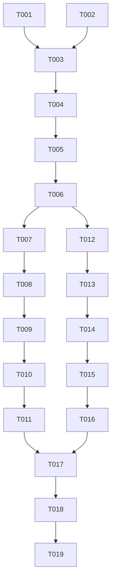

# Tasks: Relationship Intelligence Refinement (014-ri-dashboard)

**Status**: Complete ✅
**Spec**: [spec.md](./spec.md)
**Plan**: [plan.md](./plan.md)

## Phase 1: Setup ✅
*Goal: Prepare environment and verify documentation.*

- [x] T001 Verify `RI_IA_v2.md` and `RI_Wireframe_v2.md` are accessible for reference <!-- id: 0 -->
- [x] T002 Verify `recharts` and `lucide-react` dependencies are installed <!-- id: 1 -->

## Phase 2: Foundational (Data & Types) ✅
*Goal: Implement shared data structures and mock services required by both widgets.*

- [x] T003 Define `TierMetric` interface in `src/types.ts` (Ref: data-model.md) <!-- id: 2 -->
- [x] T004 Update `DashboardMetrics` in `src/types.ts` to use `TierMetric[]` <!-- id: 3 -->
- [x] T005 [P] Update `MockDashboardService.ts` to generate realistic `TierMetric` data (Total, Active, Sales, %) <!-- id: 4 -->
- [x] T006 Verify data generation via console log or temporary debug output <!-- id: 5 -->

## Phase 3: User Story 1 - View Membership Distribution (Zone 2A) ✅
*Goal: Display Total vs Active members per tier in a stacked bar chart.*

- [x] T007 [US1] Rename/Refactor `MemberScaleWidget.tsx` to `MembershipDistributionWidget.tsx` <!-- id: 6 -->
- [x] T008 [US1] Update Widget Header to show Global Total and Active Counts <!-- id: 7 -->
- [x] T009 [US1] Implement Recharts `ComposedChart` (Stacked Bar) for Tier Metrics (Total + Active) <!-- id: 8 -->
- [x] T010 [US1] Implement Custom Tooltip to show "Total" and "Active" counts on hover <!-- id: 9 -->
- [x] T011 [US1] Update `Dashboard.tsx` to use the refactored widget in Zone 2A <!-- id: 10 -->

## Phase 4: User Story 2 - View Tier Value Contribution (Zone 2B) ✅
*Goal: Display Sales Revenue and Contribution % per tier.*

- [x] T012 [US2] Rename/Refactor `TierDistributionWidget.tsx` to `ValueContributionWidget.tsx` <!-- id: 11 -->
- [x] T013 [US2] Update Widget Header to "Value Contribution" <!-- id: 12 -->
- [x] T014 [US2] Implement Recharts (Donut or Horizontal Bar) showing Sales Contribution <!-- id: 13 -->
- [x] T015 [US2] Implement Legend/List showing Tier Name, Sales Amount ($), and Share (%) <!-- id: 14 -->
- [x] T016 [US2] Update `Dashboard.tsx` to use the refactored widget in Zone 2B <!-- id: 15 -->

## Phase 5: Polish & Quality ✅
*Goal: Ensure UI matches wireframes and behaves correctly on all devices.*

- [x] T017 Verify responsive layout (Stacking on mobile/tablet) as per `RI_Wireframe_v2.md` <!-- id: 16 -->
- [x] T018 Check color palette against `RI_IA_v2.md` (Tier colors, Healthy/Active colors) <!-- id: 17 -->
- [x] T019 Run independent verification tests from `spec.md` (SC-001 to SC-004) <!-- id: 18 -->

## Dependencies

## Implementation Strategy
- **Foundational First**: We must define the `TierMetric` structure first as both widgets depend on it.
- **Parallel Work**: Once the Mock Service (T005) is ready, US1 (T007-T011) and US2 (T012-T016) can be implemented in parallel.
- **Verification**: Use `quickstart.md` scenarios to validate each story.
